[GitHub](https://github.com/singusribhavaniprasad-wq) &nbsp;·&nbsp;
[LinkedIn](https://www.linkedin.com/in/singu-sri-bhavani-prasad-81625729a/) &nbsp;·&nbsp;
[Email](mailto:singusribhavaniprasad@gmail.com)

> B.Tech Artificial Intelligence & Machine Learning student at Anurag University, Hyderabad. 
> Building practical AI-powered applications and exploring Generative AI.

I enjoy turning ideas into interactive web applications powered by AI. My current focus is on 
AI/ML, Generative AI, AI agents, full-stack development, and building practical solutions for 
real-world problems. I am continuously learning, experimenting, and improving through hands-on projects.

## EDUCATION

**Anurag University** · Hyderabad, India  
<samp>Bachelor of Technology (B.Tech) — Artificial Intelligence & Machine Learning</samp>  
Expected Aug 2027 · GPA: 6.65 / 10.0

**Sri Chaitanya Junior Kalasala** · Hyderabad, India  
<samp>Higher Secondary Education</samp>  
May 2023 · 885 / 1000

**Sri Chaitanya e-techno High School** · Hyderabad, India  
<samp>Secondary School Certificate (SSC)</samp>  
May 2021 · GPA: 9.5 / 10.0

## TECHNICAL SKILLS

<samp>
Languages: Python · JavaScript · SQL

Frontend: HTML · CSS · React.js

Backend: Node.js · Express.js

Databases: MongoDB · MySQL

Tools: Git · GitHub · VS Code · Postman · Linux

Core CS: DSA · DBMS · Operating Systems · Computer Networks · OOP

AI: Machine Learning · Prompt Engineering · Data Analytics
</samp>

## CERTIFICATIONS

<samp>
AICTE · AI & Machine Learning Virtual Internship
Cisco · Python Essentials
Cisco · Cybersecurity Essentials
Cisco · Introduction to Networks
Cisco · Packet Tracer
Cisco · Meraki Operations
Oracle · Java Fundamentals
Oracle · Database Management Systems
Infosys · Introduction to Python
Deloitte · Data Analytics Virtual Experience
</samp>

## ACHIEVEMENTS

<samp>
• Built multiple AI-powered full-stack applications.

• Completed certifications and virtual learning experiences in
  AI, Cybersecurity, Data Analytics, Python and Java.

• Regularly practice Data Structures & Algorithms and problem-solving.

• Hands-on experience building AI-powered web applications,
  Generative AI solutions and interactive software projects.

• LFB Workshop — gained hands-on experience with
  Line Following Bot concepts and implementation.
</samp>

**[AI-Powered Software Engineering Assistant](https://ai-senior-engineer.vercel.app/)**  
<samp>React.js · Next.js · Tailwind CSS · JavaScript · AI API · Vercel</samp>

AI-powered full-stack software engineering assistant designed to help developers
generate code, explain programming concepts, debug applications and answer
technical queries through an interactive conversational interface.

• Integrated Generative AI to provide context-aware coding assistance and
  support developer productivity.

• Designed a responsive and user-friendly interface using React.js and Next.js
  for seamless interaction across desktop and mobile devices.

• Deployed the application on Vercel with optimized performance, responsive
  design and a scalable architecture for real-world usage.

**[Multi-Agent Business Research & Strategy Platform](https://multi-agent-business-research-strat.vercel.app/)**  
<samp>React · Python · LangChain · LangGraph · Generative AI · AI Agents · APIs</samp>

AI-powered multi-agent platform designed to automate business research,
strategic analysis and generation of actionable business insights.

• Designed specialized AI agents to perform research, data analysis
  and strategy generation.

• Automated the process of collecting and analyzing business and
  market-related information.

• Generated actionable insights and strategic recommendations using
  Generative AI.

• Built the frontend using React.js and deployed the application on Vercel.

## BEYOND CODE

<samp>
Building AI-powered web applications and software solutions.

Creating AI-generated animations, videos and digital content using prompt engineering.

Reading about technology and personal development.

Following Formula 1 and MotoGP motorsports.
</samp>

## HOBBIES

<samp>
AI & Technology · Prompt Engineering · Digital Content Creation
· Reading · Formula 1 · MotoGP
</samp>

Every graphic here is generated locally or by the profile's GitHub Action. 
`ascii.svg` is a photo transformed through a character ramp using 
[`scripts/make_portrait.py`](scripts/make_portrait.py).

The contribution graphics are generated from the GitHub GraphQL API by 
[`scripts/generate_stats.py`](scripts/generate_stats.py) through a scheduled GitHub Action.

The profile uses a consistent monospace visual style across the portrait, 
statistics and section graphics, keeping the page lightweight and self-contained.

---

<samp>AI/ML • Generative AI • Full-Stack Development • AI Agents • Learning by Building</samp>

